# Projeto de Interface

Visão geral da interação do usuário pelas telas do sistema e protótipo de baixa fidelidade das telas com as funcionalidades que fazem parte da aplicação (wireframes).

## User Flow

Fluxo de usuário contendo as principais ações que o usuário pode executar dentro da aplicação, a fim de demonstrar o comportamento das páginas em alto nível.

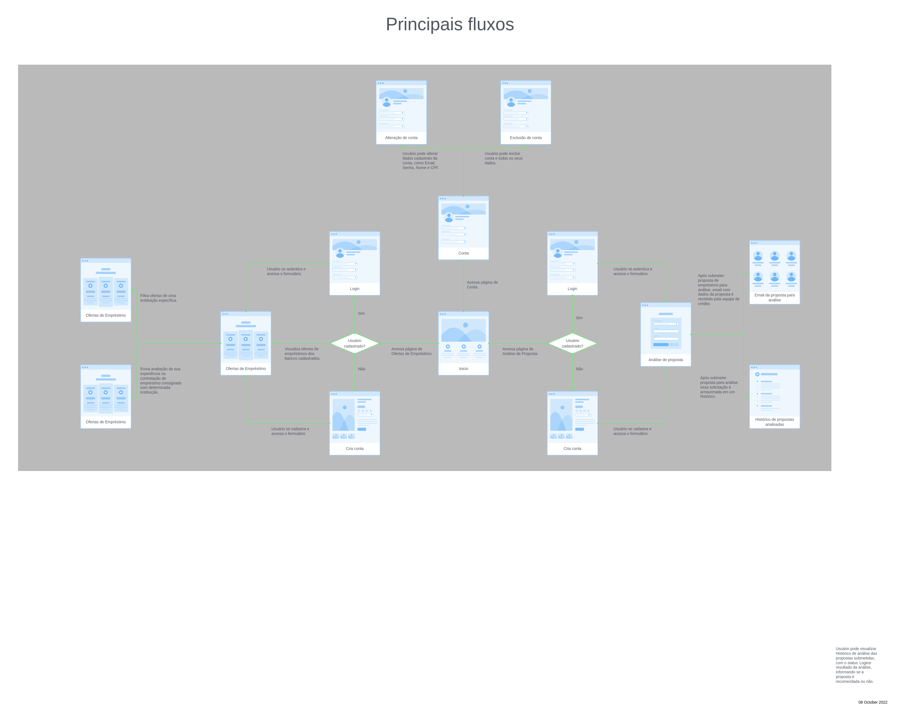

## Wireframes

É um protótipo de baixa fidelidade que descreve a estrutura das páginas e sua relação com os requisitos funcionais e não funcionais da aplicação.

A página **Entrar Conta** permite que o usuário se autentique na aplicação usando Email e Senha. Esse comportamento atende ao requisito funcional RF-001.

 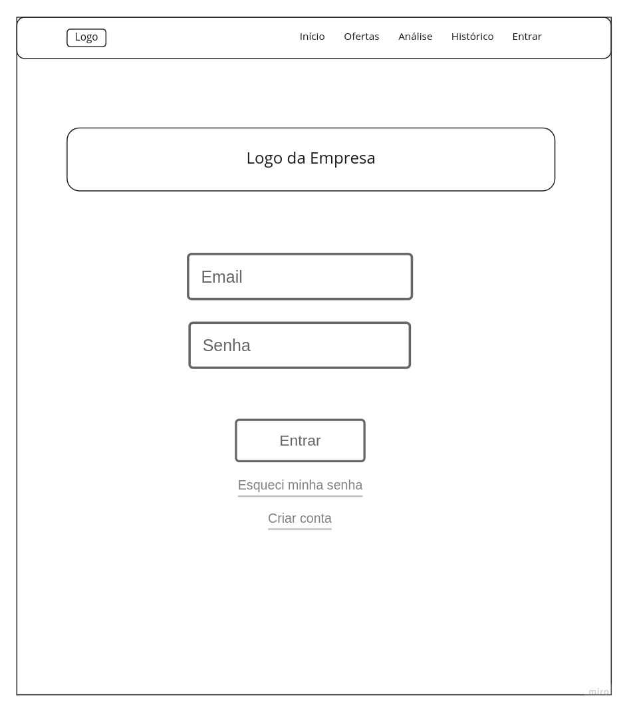

A página **Criar Conta** permite que o usuário se cadastre na aplicação informando Nome, Email, CPF e Senha. Esse comportamento atende ao requisito funcional RF-002.

 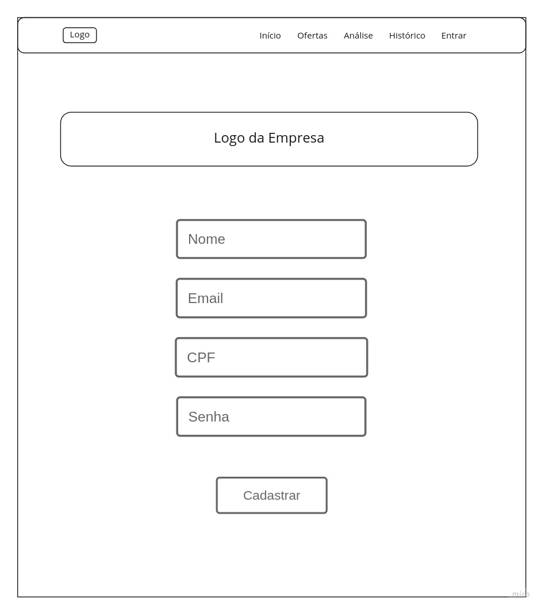

A página **Alterar Conta** permite que o usuário altere dados cadastrais da conta como Nome, Email e CPF. Esse comportamento atende ao requisito funcional RF-003.

 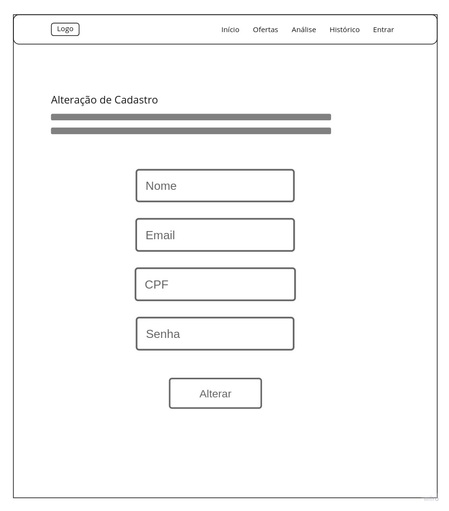

A página **Consultar Conta** permite que o usuário consulte a sua conta e todos os seus dados. Esse comportamento atende ao requisito funcional RF-004.

 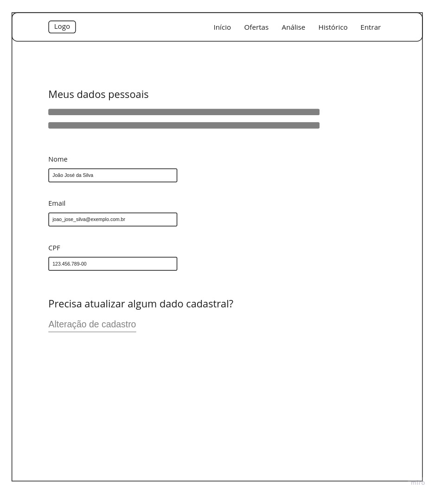

A página **Excluir Conta** permite que o usuário exclua a sua conta e todos os seus dados. Esse comportamento atende ao requisito funcional RF-005.

 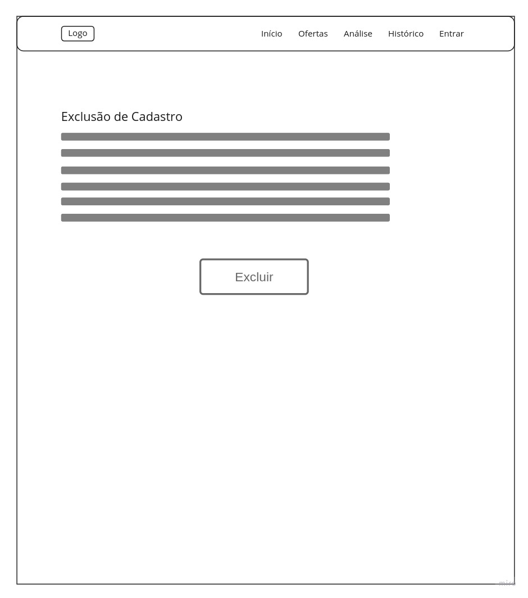

A página **Análise Proposta** permite que o usuário envie os dados de uma proposta de crédito consignado para análise da nossa equipe de Analistas de Crédito. Esse comportamento atende ao requisito funcional RF-006.

 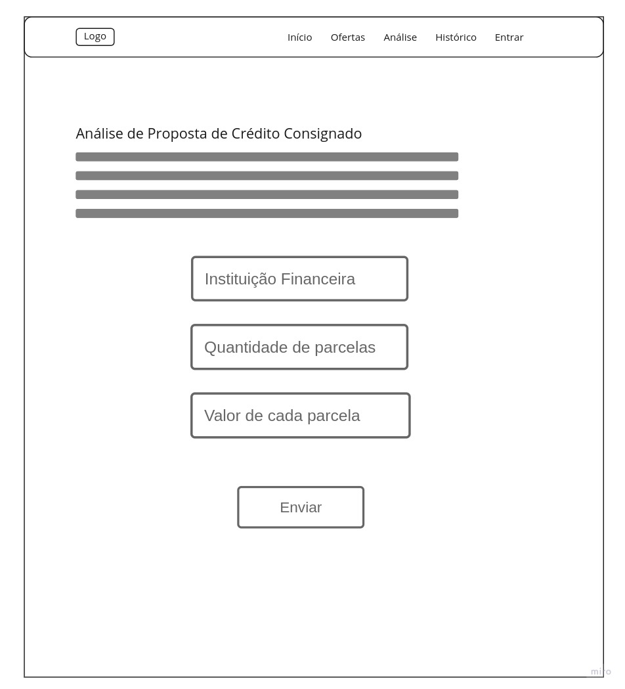

A página **Histórico Análises** permite que o usuário visualize o histórico de análises de proposta que foram submetidas na aplicação através da página **Análise Proposta**. Esse comportamento atende ao requisito funcional RF-007.

 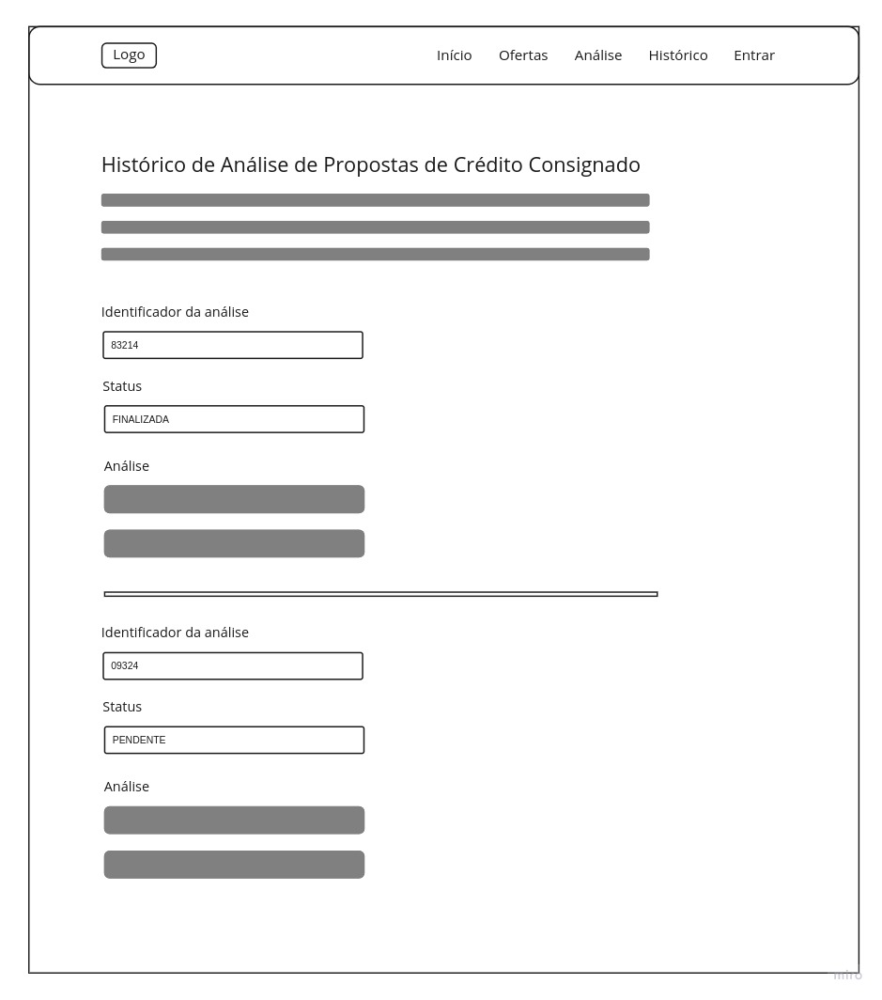

O email transacional **Solicitação Análise** permite que o nosso time de crédito o usuário visualize a solicitação de análise que foi enviada pelo usuário. Esse comportamento atende ao requisito funcional RF-008.

 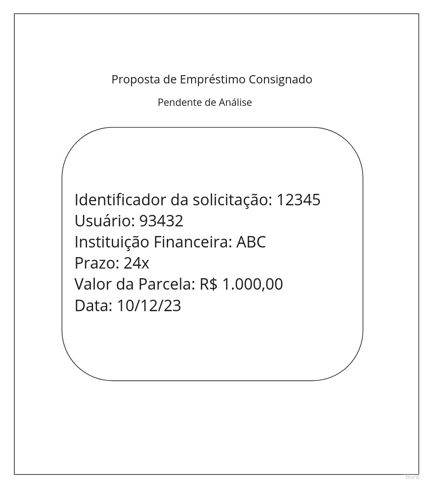

A página **Início** permite que o usuário acesse conteúdos sobre educação financeira e maiores detalhes sobre como a aplicação pode ajuda-lo na contratação de empréstimo consignado. Esse comportamento atende ao requisito funcional RF-009.

 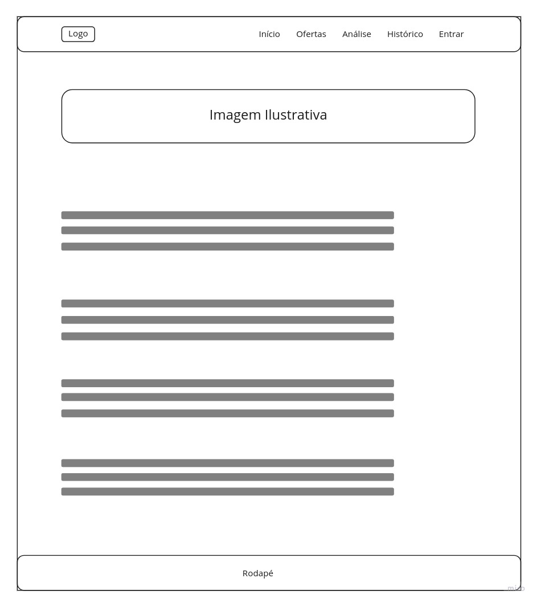

A página **Ofertas** permite que o usuário acesse ofertas de crédito consignado de determinadas instituições financeira, filtre ofertas de uma instituição específica e envie avalição da sua experiência na contratação desse produto financeiro. Esse comportamento atende ao requisito funcional RF-010, RF-011 e RF-012.

 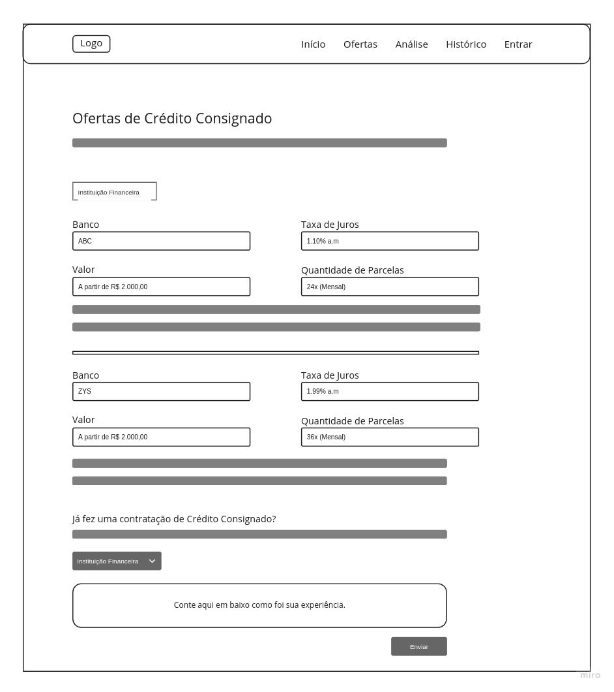

